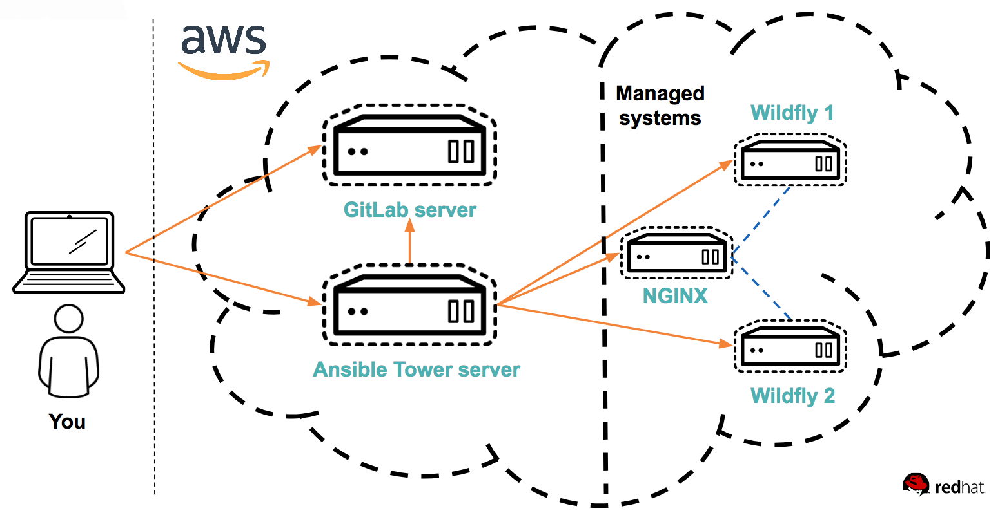

# Welcome to the lab

Hello and welcome to the lab. First off, if you are not familiar with what Ansible is:

Ansible is an powerful automation and orchestration engine, powerful enough to automate everything from IoT lightbulbs to cloud infrastructure - yet, simple enough for everyone to use. Even those who are not a programmer.

The reason why Ansible has become so pupular is because it's simple. No coding skills are required. Even a lot of non technical staff in your organization can read and understand Ansible playbooks. This simplicity means that you get started in minutes. Ansible is clientless, using SSH, Win RM or application specific APIs. Ansible also works as you think, tasks are executed in order, top to bottom - much adding to the simplicity. While simple, it's powerful enough to model the most complex workflows in IT.

Ansibles catch phrase is "automate all things" and this reflects fairly on what it can do. People use Ansible to automate all things. This differentiates it from the other automation frameworks or systems, which only automates parts of your IT landscape - adding fragmentation and lock-in while making collaboration more difficult.

# Lab graphics

In this lab, we use some basic graphics to make the lab easier to understand. Such as:

:boom: This is something which you have to do.
:star: If you have time, you can also do this.
:exclamation: Take careful notice of this, or you may fall on your face.
:thumbsup: This text contains information about a best practice.
```
Here is some code that you need to run
```
```
Here is an example of expected output when running commands
```

# :exclamation: If something goes wrong
If by some reason you get stuck in a lab - then here's what you should do. **Follow below steps 1-5**. _Do not skip any steps if not told to._

1. If you do not understand what to do in a lab, or do not understand what you are doing, skip immediately to step 5. Also, the authors of this lab apologize for that. The purpose of this lab is so that everyone can do it and understand it.
2. This lab has seen plenty of use, so chances are that you have simply not followed the lab instructions. Start by reading the lab instructions again, carefully.
3. If you are sure that you are doing things as described in the labs, perhaps you typed something wrong or had a copy-paste accident. Double-checking your file's content and comparing them with the content described here in the lab. If you typed things manually, try doing a clean copy-paste from the lab page instead.
4. Ask the person beside you if that person also had an issue with what you are doing. If so, that may indicate there is actually something wrong.
5. Raise your hand and someone will come and help you :)

# Preparations to do the lab

:exclamation: To get started with the labs, you first needs to get your assigned username and servers. This will be provided to you by the people who operates this lab. 

:exclamation: Do not skip any labs, the labs depends on the previous ones to be completed. You need to do them in order, 0-10.

:exclamation: On purpose, security in this lab has not been made a priority, that is so you as a student get more freedom to learn. You have passwordless admin access via _sudo_ on all systems. With that said, if you do something which is outside of the labs and break your systems, _you get to keep all the pieces_ ;) 

:boom: Make sure you have the required tools to do the lab. The tools are listed below:
* An SSH client. On Linux and Mac, use the native ssh client in a terminal. On Windows, you can use PuTTy https://www.chiark.greenend.org.uk/~sgtatham/putty/latest.html) if nothing else is available.
* A web browser. Ansible Tower officially supports latest version of Firefox and Chrome, so if you bump into any issues, try one of those web browsers.

:boom: Review the overview of the lab environment. Most importantly, the Ansible Tower server is from where all the labs are done.

:exclamation: PLEASE NOTE. DO NOT execute any of the labs from your local laptop.



The Ansible Tower server will have the responsibility of provisioning the managed systems in later labs. For now, you will spend time in the Ansible Tower server.

:exclamation: It's not possible to ping your managed systems. If you need to troubleshoot connectivity to your managed systems, use the ping playbook you will create in Lab 2.

:exclamation: The systems you will be working on runs Red Hat Enterprise Linux (7.5), if you are new to Linux, see below for a simple guide for common commands: 
* **Linux cheat sheet**: https://files.fosswire.com/2007/08/fwunixref.pdf

:exclamation: Once in the system, you have to use one of the text based text editors (nano, vim, emacs, joe) available.
Use below links as reference when needed. For now, continue on:
* **nano**: https://wiki.gentoo.org/wiki/Nano/Basics_Guide
* **vi/vim**: https://vim.rtorr.com/ 

:boom: Using your SSH client, log in as the **student** user on your assigned Ansible Tower server.
On Linux/Mac/Windows with shell:
```
$ ssh student@IP-ADDRESS-OF-TOWER-SERVER
```
On Windows with PuTTy, see this link:\
https://mediatemple.net/community/products/dv/204404604/using-ssh-in-putty-

:boom: Once logged in, run below commands to pull this repository to your system:
```
cd
git clone https://github.com/mglantz/ansible-roadshow.git
```
:boom: The variable **$LAB_DIR** will refer to the root of the cloned repository and make it persistant, export it as an variable using below command:
```
echo "export LAB_DIR=/home/student/ansible-roadshow" >>~/.bashrc && . ~/.bashrc
```

:boom: In the **student** user's home directory create an empty dir named **work**, where you will do your assignments. This dir will be referred to as **$WORK_DIR**, export $WORK_DIR as a variable in your shell. To do this, run:
```
cd
mkdir work
echo "export WORK_DIR=/home/student/work" >>~/.bashrc && . ~/.bashrc
```

```
End of lab
```
[Go to the next lab, lab 1](../lab-1/README.md)

