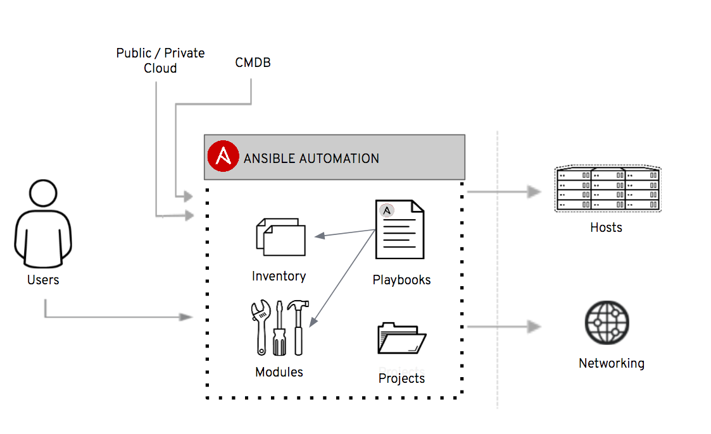

# About Ansible Playbooks

In the previous lab, you called a module directly from the command-line interface. Modules are what does all the work in Ansible. The ping module, which we used in lab 1, is part of the module library of Ansible. The module library is included with the Ansible installation, and can be used without installing any extra stuff. For a complete overview of modules, refer to [the module index](http://docs.ansible.com/ansible/latest/modules_by_category.html).

In almost all cases, you will use a playbook for automating the management of your servers. Think of a playbook as a recipe for the state of your servers as well as other infrastructure components. In a playbook you can describe everything from software which needs to be installed on servers to how load balancers should be configured. And everything which is done, is done by a module which is called, as shown below.



A playbook can also describe sequences of actions and other process related concerns. The Ansible runtime is the (_state_) engine, which interprets and applies the playbooks to the servers.

 :thumbsup: But before we start, let's details some basic best practices when writing playbooks. We recommend following three guiding principles regarding all Ansible related.

* Complexity kills productivity (keep it simple, it makes it robust, scalable and easy to maintain)
* Optimize for readability (makes for easier collaboration, maintenence and makes it more robust)
* Think declaritively (Ansible is a state engine, do not try to 'code' with playbooks)

When in doubt about what to do, always go back to these three principles.

:thumbsup: The autonomy of a basic playbook is as follows:
```
- name: Description of the play, here you describe what the end goal of all the tasks below is.
  hosts: all/group-name
  vars:
    app1_meaningful-name: value 
  tasks:
    - name: Describe what this specific task is going to do
      module-name:
        argument1: static-value
        argument2: "{{ app1_meaningful-name }}"
```
:thumbsup: Playbook best practices includes:
* Give everything human-meaningful names and descriptions. A huge advantage of Ansible is that it's very close to written language. Well written playbooks can be understood by everyone and also works as documentation. Do not destroy that feature :)
* Ansible uses a flat naming space, so variables can easily collide, prefix variables with "owner" such as application or package name.
* Separating logic from variables makes it easier to re-factor playbooks into roles and makes it easier to override behavior of the playbook.
* Make variable names a part of the documentation by choosing human-meaningful names
* Use native YAML syntax because vertical reading is easier for _humans_. More on that below.

Example playbook to install a Tomcat application server:
```
- name: Install Tomcat and ensure it runs
  hosts: tomcat-servers
  vars:
    tomcat_service_state: started
    tomcat_enabled_across_reboot: yes
  tasks:
    - name: Ensure that the Tomcat RPM is installed
      yum:
        name: tomcat
        state: latest
    - name: Ensure that the tomcat service is enabled and started
      service:
        name: tomcat
        enabled: " {{ tomcat_enabled_across_reboot }}"
        state: "{{ tomcat_service_state }}"
```

 :thumbsup: There are several ways you can write a playbook. Looking at the internet, you'll find them all. Again, what we recommend is to use the native YAML syntax. The reason for that is that reading vertically is _easier_ than reading horizontally. Observe below two example where both are valid Ansible, which one do you prefer reading? Which one is easier to scan for a specific value?

* Valid syntax
```
- name: install telegraf
  yum: name=telegraf-{{ telegraf_version }} state=present update_cache=yes disable_gpg_check=yes enablerepo=telegraf
  notify: restart telegraf
```
* Native YAML syntax
```
- name: install telegraf
  yum:
    name: telegraf-{{ telegraf_version }}
    state: present
    update_cache: yes
    disable_gpg_check: yes
    enablerepo: telegraf
  notify: restart telegraf
```

# :boom: Writing your first Ansible Playbooks

:boom: Now, we're ready to create our first playbook. Let's try to implement the ping example using a playbook. Create a playbook: $WORK_DIR/ping.yml, by pasting below into your terminal: 

```
cat << 'EOF' >$WORK_DIR/ping.yml
---
- name: Ping all servers
  hosts: all
  tasks:
  - name: Ping a server using the ping module
    ping:
      data: pong from Ansible
EOF
```

:boom: This will do the same as the previous lab, except the ping message is different. The ping message takes an argument *data*, which is the reply message from the ping module. You can now run the playbook with the command

```
ansible-playbook -i hosts ping.yml
```

:boom: Wouldn't it be nice if you could actually see the reply from the ping module? This can be done by using return values combined with the *msg* module. Change the *$WORK_DIR/ping.yml* file to the following

```
---
- name: Ping all servers
  hosts: all
  tasks:
  - name: Ping a server using the ping module
    ping:
      data: pong from Ansible
    register: ping_answer
  - name: Output the value of the ping answer
    debug:
      msg: "Return value from ping is '{{ping_answer.ping}}'"
```

:boom: And run the playbook again by running below command:
```
ansible-playbook -i hosts ping.yml
```

This will result in the following output:

```
$ ansible-playbook -i hosts ping.yml

PLAY [Ping all servers] *****************************************************

TASK [Gathering Facts] ******************************************************
ok: [wildfly2]
ok: [wildfly1]
ok: [loadbalancer1]

TASK [Ping a server using the ping module] ***********************************
ok: [wildfly2]
ok: [wildfly1]
ok: [loadbalancer1]

TASK [Output the value of the ping answer] **********************************
ok: [loadbalancer1] => {
    "msg": "Return value from ping is 'pong from Ansible'"
}
ok: [wildfly1] => {
    "msg": "Return value from ping is 'pong from Ansible'"
}
ok: [wildfly2] => {
    "msg": "Return value from ping is 'pong from Ansible'"
}

PLAY RECAP *****************************************************************
loadbalancer1              : ok=3    changed=0    unreachable=0    failed=0   
wildfly1                   : ok=3    changed=0    unreachable=0    failed=0   
wildfly2                   : ok=3    changed=0    unreachable=0    failed=0   

 
```

Now you can see the output from the ping module. Nice! Return values are useful for a lot of things.\
Also, isn't it nice to see loadbalancer1 instead of _ec2-18-184-79-97.eu-central-1.compute.amazonaws.com_? :smile:

Another useful feature of Ansible is the PLAY RECAP. Here you can see how running the playbooks went. For now just notice that no state has changed (changed=0 for each server). This is because the ping message never changes state of the server and thus is idempotent. Idempotency is an important concept in Ansible. Idempotency means that the module called will have the same effect on the server, no matter how many times you run it on the server (more about that later).

:star: Try changing the ping message to 'crash'. What happens? HINT:
1. Look in the [source code for the ping module](https://github.com/ansible/ansible-modules-core/blob/devel/system/ping.py)
2. Do appropriate change in ping.yml and run the playbook again. It may look like an exception, but don't worry, that's expected, read the code...

```
End of lab
```
[Go to the next lab, lab 3](../lab-3/README.md)
