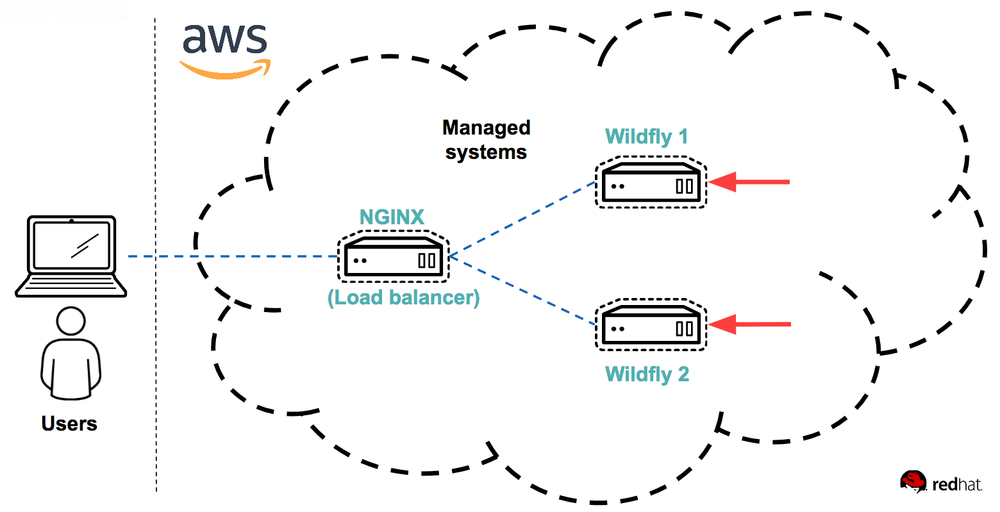

# Writing the WildFly playbook

In this lab, you'll start the real work and deploy a WildFly Swarm application to a number of servers. 
Let's overview which part of the system which you will be working on in this lab.



Running WildFly Swarm is a bit different than running traditional application servers, which often are hundreds of MB or even GB in size. You package your application into a fat jar file, which you run from the command-line interface. The jar file is very small (measured in few MB) and only contains the libraries necessary to run your application. In order to ensure that your application is easily maintainable and that it'll come up in the case of a server restart, you'll register the application as a service using systemctl.

For this excercise we assume that you've already packaged your application, using maven and pushed it to Nexus. From there you've pulled the file to the location *$LAB_DIR/labs/lab-3/lab-files/binaries/example-jaxrs-war-swarm.jar*

 :thumbsup: In order to ensure that you don't end up with a large unmaintainable yaml-file and so that you can more easily re-use Ansible automation, the lead architect of your company has decided that you must structure your playbook using [roles](http://docs.ansible.com/ansible/latest/playbooks_reuse_roles.html). Roles is a way to structure your playbook around different aspects of your configuration. In this case, you will make a role for your WildFly application and only apply that role to your wildflyservers.

:boom: In *$WORK_DIR* copy the jar file to a binary folder.

```
mkdir -p $WORK_DIR/binaries
cp $LAB_DIR/labs/lab-3/lab-files/binaries/example-jaxrs-war-swarm.jar $WORK_DIR/binaries
```

:boom: Create the rest of the structure for creating the playbook. Use the command *ansible-galaxy init* to easily create a template for your new role by running the commands below:

```
cd $WORK_DIR
ansible-galaxy init roles/wildflyapp
```
This will create a full structure for the WildFly role named *wildflyapp*. In the folder *$WORK_DIR/roles/wildflyapp/tasks* there is a file named main.yml. This file will contain the tasks needed to configure the WildFly application on the server.

:boom: Add the nessicary tasks to install WildFly by pasting in below in a terminal:

```
cat << 'EOF' >$WORK_DIR/roles/wildflyapp/tasks/main.yml
---
# tasks file for roles/wildflyapp
- name: Install java
  yum:
    name: java-headless
- name: Create directory to store binary
  file:
    path: /opt/wildflyapp
    state: directory
- name: Copy jar file to the server
  copy:
    src: binaries/example-jaxrs-war-swarm.jar
    dest: /opt/wildflyapp/example-jaxrs-war-swarm.jar
    mode: 0644
- name: Create service script
  copy:
    src: roles/wildflyapp/files/wildflyapp.service
    dest: /etc/systemd/system/wildflyapp.service
    owner: root
    group: root
    mode: 0644
- name: Reload systemd
  systemd:
    daemon_reload: yes
- name: Enable wildfly app service script
  systemd:
    name: wildflyapp
    enabled: yes
    masked: no
- name: Make sure the wildfly app service is running
  systemd:
    name: wildflyapp
    state: started
EOF
```

:boom: Review the different tasks and make sure you understand what is done above. Information about how to use all modules included in Ansible is as mentioned before, available in the module index, here: https://docs.ansible.com/ansible/latest/modules/list_of_all_modules.html. But, the _ansible-doc_ command also helps you to get information about modules. Try it out on the modules used above by running:(in order to Quit- press"Q")
```
ansible-doc yum
ansible-doc file
ansible-doc copy
ansible-doc systemd
```
:boom: You can also find a full list of all modules availabe in your system by running (_command will take a couple of seconds to run_):
```
ansible-doc -l
```

:boom: Use the _grep_ command to quickly search for specific modules to do a specific task. Try it out. For example:
```
ansible-doc -l|grep -i "cisco"
```

Returning to the work at hand, our WildFly application. You can see that starting a WildFly Swarm application is pretty simple. There is no need for a 1 GB app server with a million dependencies here. We only need to copy the jar file to the server, create a service script (which starts and stops the wildfly) and run the application. But before we can start our application, we need to create the service script, which is to be copied to the server. 

:boom: To do so, create the file *$WORK_DIR/roles/wildflyapp/files/wildflyapp.service* and put the following content in the file:

```
[Unit]
Description=Wildfly Swarm Application Script
After=auditd.service systemd-user-sessions.service time-sync.target

[Service]
User=root
TimeoutStartSec=0
Type=simple
KillMode=process
WorkingDirectory=/opt/wildflyapp
ExecStart=/bin/java -jar /opt/wildflyapp/example-jaxrs-war-swarm.jar
Restart=always
RestartSec=2
LimitNOFILE=5555

[Install]
WantedBy=multi-user.target
```

:boom: Finally you need to apply the newly created role to your *wildflyservers* group. In directory *$WORK_DIR* create a playbook named *site.yml*. Put the following content into the file:

```
---
- name: Install Wildfly
  hosts: wildflyservers
  become: yes
  tasks:
  - include_role:
      name: wildflyapp
```

As you can see we now include the role *wildflyapp* for all *wildflyservers*. Please also note the line
```
  become: yes
```
:thumbsup: This is because we need more access in order to install software and enable services on the target systems. This line means that Ansible will (in this case) call upon a software called _sudo_ installed on the target systems to gain admin access when running the wildflyapp role. This works because _sudo_ has been configured on the target systems for the student user - during the setup of this lab. Best practice is to use _become_ to provide specific privledge escalation required to do specific things, instead of running as a user which is administrator all the time. You do this to mitigate risk of system compromise by someone with playbook access and to reduce risk that someone accidentally destroys a system. You can either define _become_ for a complete play and all the tasks in it (like above), or do it for a specific task by defining _become_ on the task level as shown below:

Example:
```
- name: Start apache web server
  hosts: webservers
  tasks:
  - name: Start the apache web service
    service:
      name: httpd
      state: started
    become: yes
```

:star: To read more about your ability to control privledge escalation, go here: https://docs.ansible.com/ansible/latest/user_guide/become.html

:boom: With this said, let's run the playbook we created. It will install Wildfly on your servers in the wildflyservers group. Run below command to do this:

```
ansible-playbook -i hosts site.yml
```

You should see Ansible executing the playbook. At the end of the Ansible output there is a recap of how running the playbook went:
```
PLAY RECAP ****************************************************************
wildfly1                   : ok=8    changed=6    unreachable=0    failed=0   
wildfly2                   : ok=8    changed=6    unreachable=0    failed=0   
```

Ansible should complete with no errors. You should see the changes applied to both WildFly Swarm servers.

:boom: You can now access the service at the address *http://$HOSTNAME:8080*, where *$HOSTNAME* points to one of the servers mentioned in the play recap. Try it out by running below command:

```
curl http://111.222.333.444:8080
```
Where 111.222.. is the IP address of one of your wildfly servers.

Example output should be:
```
$ curl http://18.197.135.122:8080
Howdy from unknown at 2018-08-30T22:25:09.897Z (from ip-172-31-25-165.eu-central-1.compute.internal)
```

This is pretty cool, by using the simple role you just created, people can now get their own WilfFly servers, using a 7 lines long playbook.

```
---
- name: Install Wildfly
  hosts: wildflyservers
  become: yes
  tasks:
  - include_role:
      name: wildflyapp
```

:boom: Now, try running the playbook again. This time you'll get a different output:

```
PLAY RECAP ****************************************************************
wildfly1                   : ok=8    changed=0    unreachable=0    failed=0   
wildfly2                   : ok=8    changed=0    unreachable=0    failed=0 
```

Most modules in Ansible are idempotent, ensuring that no matter how many times you run the playbook, the result on the server will be the same. Thus on the second run, Ansible detected that no changes were necessary, since the servers were already in the wanted state and thus didn't apply any changes. This is a cool feature of Ansible. For instance if you want to add an extra server, just add the server to the hosts file and run the playbook again without worrying about the existing servers.

```
End of lab
```
[Go to the next lab, lab 4](../lab-4/README.md)
