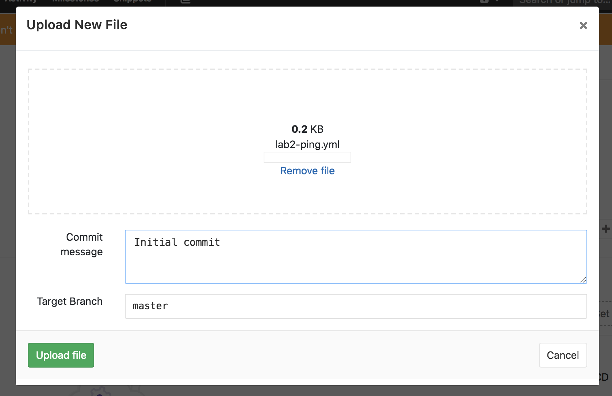

# Working with Ansible as code

```
Do you already know git? Do you work with version control on a daily basis?
Do you not need to be told why it's not only useful, but a requirement for collaboration?
```
-Then you can skip this chapter and jump forward to [lab 7](../lab-7/README.md). Otherwise, carry on.

A challenge when doing larger scale automation is to enable collaboration for people to work on the same pieces of automation together. Luckily for us, programmers has since long solved this issue for us using version handling systems, such as git.

Ansible does not require you to use git version handling, but there are some good reasons why you should familiarize yourself with it.

When you scale out your Ansible usage (aka. automate all things) you’ll have many different teams collaborating, and:
1. Git was invented to solve common collaboration challenges
2. Git has earned its worldwide popularity the hard way and is in the core of many of the world’s most popular collaboration services and products

Take some time and think about the different teams or people that you would like to collaborate with, or what teams you would need to collaborate with in order to automate your complete enterprise.

 

# What is git and how does it work?
A simplified description of git follows.

1. A git repository stores files
2. Access controls are specific to repositories
3. All changes to all files are tracked
4. When you want to make a change to a file in a repository, you first make a local copy of the repository which is stored on your computer, you then change the file locally, commit the change locally and then go ahead and tell git to copy this local change to the repository.


5. You may have different copies of a repository at the same time, these copies are called branches and are key when collaborating together with other people in the same repository. When copying content between branches, that is referred to as merging.

 

6. This may seem a bit cumbersome, but you will get used to it. Promise.

>If you are completely new to git and feel you need to review the basics, please go here: https://try.github.io and complete the excersises.

# Git workflows
1. There are many different workflows for git which describes how to work with git
2. Some of these workflows are more complicated and all have their own challenges
3. Keeping things simple is good
4. You can always adapt things afterwards to fit your challenges better

# The GitHub workflow
1. Does not require GitHub, the workflow model is just called that
2. A very simple workflow
3. Master branch is always possible to release
4. Branches are where you develop and test new features and bugfixes
5. Yes, I wrote test. If you do not test your Ansible code you cannot keep the master branch releasable and this all fails.

 

Now, as an exercise you will try out the GitHub workflow. Try to find a friend to do this exercise with.

 [Working with your playbooks on Gitlab](#working-with-your-playbooks-on-gitlab)

# Working with your playbooks on GitHub
As an example of a git based version handling/collaboration system, we'll use GitHub for simplicity.

>As a first step, go ahead and create a new repository on GitHub and put the ping playbook [that you created in lab-2](https://github.com/mglantz/ansible-roadshow/tree/master/labs/lab-2/README.md) there.

>Next step, go ahead and make a change to your playbook via the GitHub web UI. When you commit the change, select 'Create a new branch for this commit and start a pull request.' as depicted below.

 

What happens next is that your change is copied into this new copy of your repository, called a branch. This is so that you and others can collaborate on this change, without affecting the code in the master branch (copy) of your repository. This allows your master branch to be stable, while development is ongoing. This also allows for several people to work on the code in your repository, at the same time.

>Now click on 'Create pull request' to complete the creation of the new branch and copying your change to it.

 

You will now get redirected to the page with overviews your pull request. Here you can use the comment function displayed in the 'Conversation' tab to collaborate with other people. Perhaps your change needs a code review or you need some advise on how to solve a specific problem? The 'Commits' and 'Files changed' allows you to overview all changes made into your newly created branch, from now on.

>Explore the 'Conversation' feature and try add yet another change to your playbook and review how all your changes are visible on the pull request page.

The pull request has yet another function, which is to allow someone else than you to approve changes, before they get copied into your master branch. Normally, not everyone has access to 'Merge pull request' which will copy all your changes into the master branch from this temporary branch where you do your work.

>After having merged your work, select to delete your branch.

 

 The reason why you delete your branch afterwards is because that allows people to see when work has been completed. Also, it allows someone to overview the status of the development work being done. For example, if a branch has lived on for too long, the risk of merge conflicts (when several people has changed the same files) becomes greater. Because of that and because code quality usually suffers when you do too much work at once, try biting off a good sized chunk of work. It's better that you do several smaller chunks of work than one huge chunk which takes a long time to do.

```
End of lab
```
[Go to the next lab, lab 7](../lab-7/README.md)

# Working with your playbooks on Gitlab
This example uses Gitlab that is part of the lab environment.

>As a first step, go ahead and create a new repository on Gitlab:

 

Once you click the ```Create a project``` -button, you will be taken here:

 

What you need to do is
>1. Give your project(repository) a nice name
>2. Tick the box, so that a README.md -file will be pre-populated to your new project(repository)
>3. ```Create project```
>Once the project(repository) has been done, you should put the ping playbook the ping playbook [that you created in lab-2](https://github.com/mglantz/ansible-roadshow/tree/master/labs/lab-2/README.md) there:

  

After you will see a popup window like this:

 

>You should drag&drop the ping.yml playbook to that window and hit ```Upload file``` -button.

Once the file has been uploaded, you will be redirected to another page.
>On this section you should modify the playbook on the web UI by pushing ```Edit``` -button:
 

Once you've done some modifications, on the bottom of the page you can see this:


This section will save your modifications on a separate branch if you like to.

>By default the setting on __1.__ is master, but you should change it to something different i.e. branch-1

What happens is that your change is copied into this new copy of your project, called a branch. This is so that you and others can collaborate on this change, without affecting the code in the master branch (copy) of your project. This allows your master branch to be stable, while development is ongoing. This also allows for several people to work on the code in your repository, at the same time.

>By ticking the box __2.__ Gitlab will automatically create merge(pull) request for you:


It is a good practice to write a brief description of the changes you've done, so that anyone going through the merge(pull) requests doesn't necessarily have to read your code to figure out what was done.

Once you've written the description for you modifications, at the bottom of the page you will see this:


Source branch allows you to choose which branch you would like to merge to the target branch of your choice, which is master in this case.

As we know that we won't be doing more modifications on that branch, we can tick the box for Gitlab to automatically remove it once the merge(pull) request has been accepted.

You will now get redirected to the page which overviews your merge(pull) request. Here you can use the comment function displayed in the 'Discussions' tab to collaborate with other people.
Perhaps your change needs a code review or you need some advise on how to solve a specific problem? The 'Commits' and 'Changes' allow you to overview all changes made into your newly created branch.


>Explore the 'Discussions' feature and try add yet another change to your playbook and review how all your changes are visible on the merge(pull) request page.

The merge(pull) request has yet another function, which is to allow someone else than you to approve changes, before they get copied into your master branch.
Normally, not everyone have rights to accept merge(pull) request which will copy all your changes into the master branch from this temporary branch where you do your work.

In this case, we accept the absolutely terrific changes that you've made.

After the merge(pull) request has been accepted on the main page of the project you will se the merge as commit to the main branch of the project:


The reason why you delete your branch afterwards is because that allows people to see when work has been completed.
Also, it allows someone to overview the status of the development work being done. For example, if a branch has lived on for too long, the risk of merge conflicts (when several people has changed the same files) becomes greater.
Because of that and because code quality usually suffers when you do too much work at once, try biting off a good sized chunk of work.
It's better that you do several smaller chunks of work than one huge chunk which takes a long time to do.


```
End of lab
```
[Go to the next lab, lab 7](../lab-7/README.md)
