# :thumbsup: Working with Ansible as code

A challenge when doing larger scale automation is to enable collaboration for people to work on the same pieces of automation together. Luckily for us, programmers have since long solved this issue for us by using version handling systems, such as git.

Ansible does not require you to use git version handling, but there are some very good reasons why you should familiarize yourself with it.

If you are familiar with git, git workflows and modern collaboration platforms such as GitLab or GitHub, you can skip down to the hands on part of this lab, here: [Working with your playbooks on GitLab](#working-with-your-playbooks-on-gitlab)

When you scale out your Ansible usage (aka. automate all things) you’ll have many different teams collaborating, and:
1. Git was invented to solve common collaboration challenges
2. Git has earned its worldwide popularity the hard way and is in the core of many of the world’s most popular collaboration services and products

Take some time and think about the different teams or people that you would like to collaborate with, or what teams you need to collaborate with in order to automate your complete enterprise.

 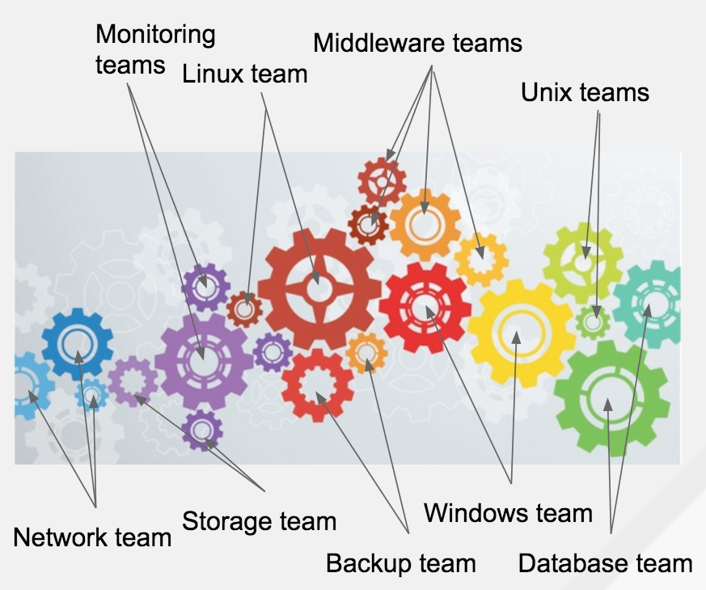

# What is git and how does it work?
A simplified description of git follows.

1. A git repository stores files
2. Access controls are specific to repositories
3. All changes to all files are tracked
4. When you want to make a change to a file in a repository, you first make a local copy of the repository, which is stored on your computer. You then change the file locally, commit the change locally, and then go ahead and tell git to copy this local change to the remote repository.


5. You may have different copies of a repository at the same time. These copies are called branches and are a key element when collaborating together with other people in the same repository. When copying content between branches, that is referred to as merging.

 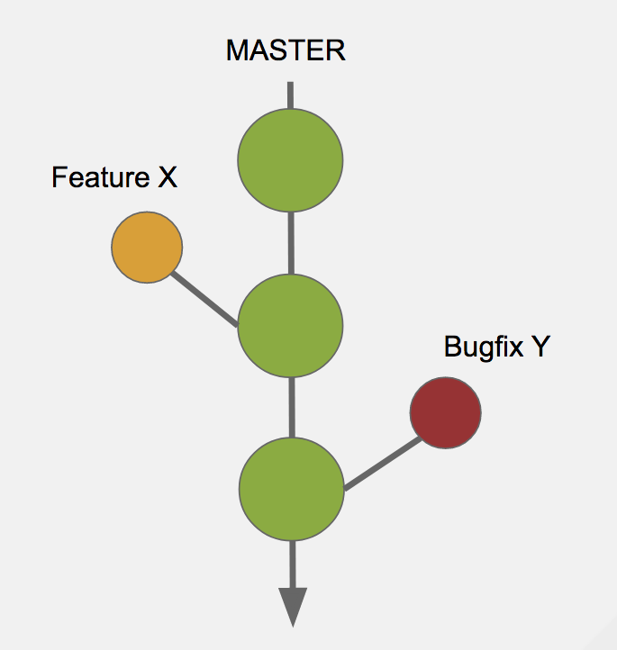

6. This may seem a bit cumbersome, but you will get used to it. Promise.

# Git workflows
1. There are many different workflows for git, which describe how to work with it.
2. Some of these workflows are more complicated and all have their own challenges.
3. Keeping things simple is good.
4. You can always adapt things afterwards to fit your challenges better.

# The GitHub workflow
1. Does not require GitHub, the workflow model is just called that.
2. A very simple workflow.
3. Master branch is always possible to release.
4. Branches are where you develop and test new features and bugfixes.
5. Yes, I wrote test. If you do not test your Ansible code you cannot keep the master branch releasable and this all fails.

 

Now, as an exercise you will try out the GitHub workflow. Try to find a friend to do this exercise with.

If you are using the GitLab environment that is setup as a part of the lab environment, follow the instructions below:
 [Working with your playbooks on GitLab](#working-with-your-playbooks-on-gitlab)

If you are using GitHub (you are not, chapter under construction), follow the instructions below:
 [Working with your playbooks on GitHub](#working-with-your-playbooks-on-github)

# Working with your playbooks on GitLab
:boom: First step, with your web browser, go to the GitLab server: https://$gitlab_server and login with gitlab user and the password provided to you at the start of the lab. 

GitLab is an open source software which provides both a git server and a place where you can collaborate easily around the code put in git.

:boom: When logged in, go ahead and create a new repository on Gitlab. Name the project **studentX-project**. You will reference this later on in **lab 8**. The project is where you will store your files:

 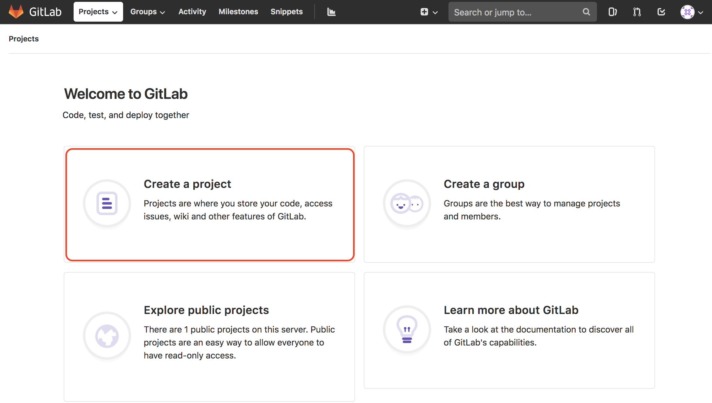

:boom: Once you click the ```Create a project``` -button, you will be taken here:

 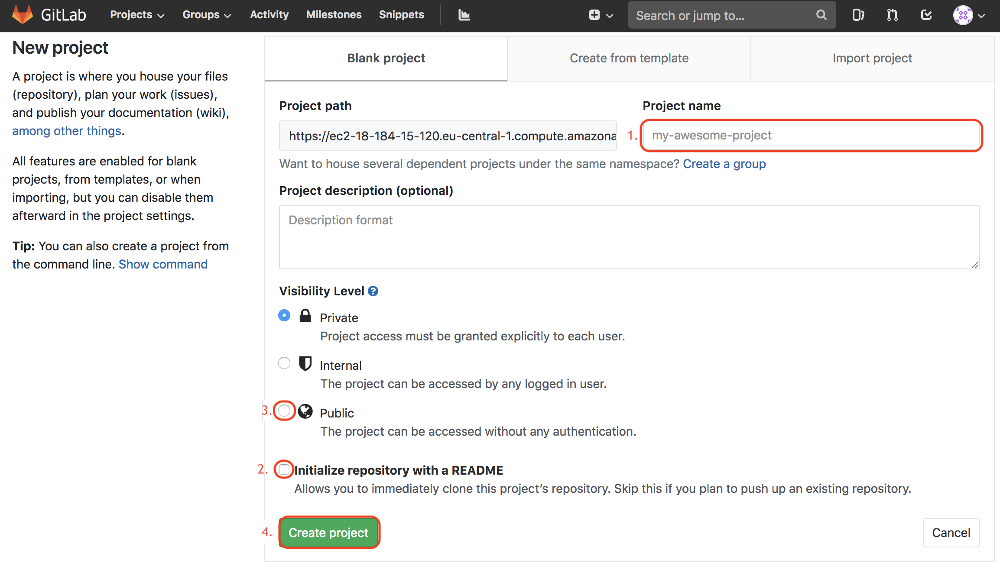

What you need to do is\
:boom: Name your project (repository) **studentX-project**. You will reference this later on in **lab 8** \
:boom: Tick the box, so that a `README.md` -file will be pre-populated to your new project(repository)\
:boom: Make the project public, so you can access the contents from Ansible Tower without using credentials (lab7)\
:boom: ```Create project```\
:boom: Once the project (repository) has been done, you should copy & paste contents of the ping playbook [that you created in lab-2](https://raw.githubusercontent.com/mglantz/ansible-roadshow/master/labs/lab-2/lab-files/ping.yml) there:

  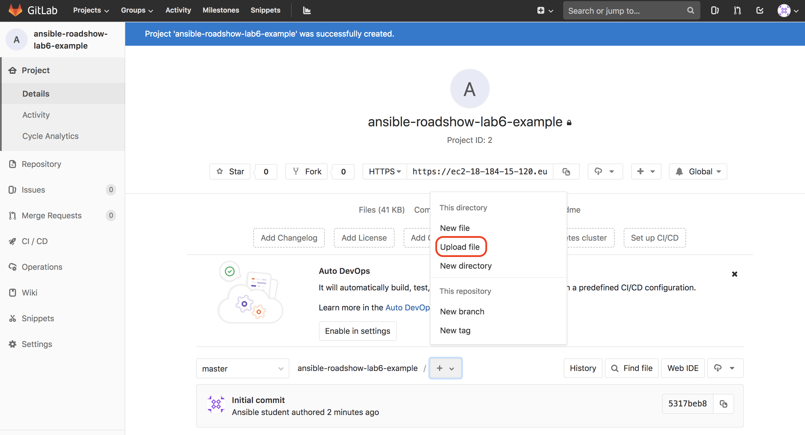

After you will be directed to a page like this:

 

:boom: Copy & paste contents of the ping playbook [that you created in lab-2](https://raw.githubusercontent.com/mglantz/ansible-roadshow/master/labs/lab-2/lab-files/ping.yml) here and give the file a name i.e. __ping.yml__ and hit ```Commit changes``` -button on the bottom of the page.

Once the file has been created, you will be redirected to another page.

Now let's try the so called GitHub workflow. That means that when we make a modification, we add it to a separate branch first, allowing us to do review of the code, before it get's copied into the main (production) branch.

:boom: On this section you should modify the playbook on the web UI by pushing the ```Edit``` -button:
 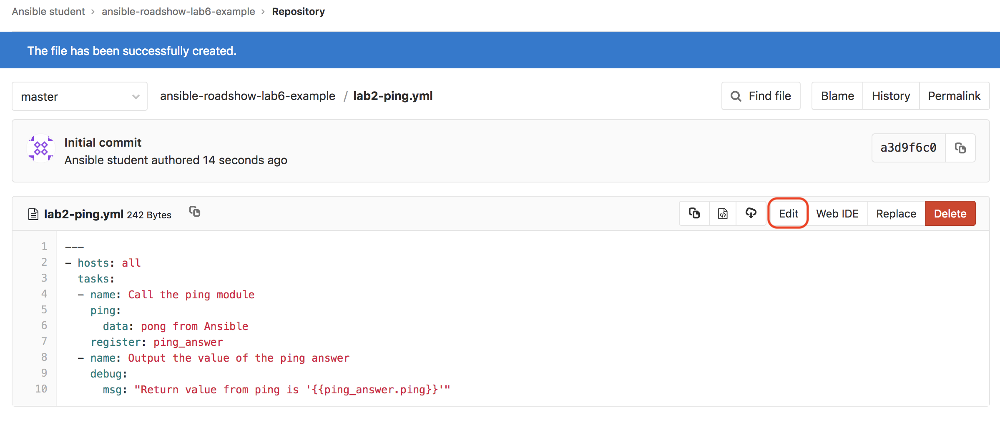

:boom: Once you've done some modifications, on the bottom of the page you can see the fields descibed in the image below. You should save your modifications on a separate branch, and to do that you need to define a name for it. By default the setting on target branch (see __1.__) is master, but you should change it to something different, for example feature-1.

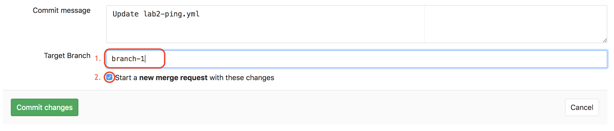

:thumbsup: What happens is that your change is copied into this new copy of your project, called a branch. As explained before, this is so that you and others can collaborate on this change, without affecting the code in the master branch (copy) of your project. This allows your master branch to be stable while development is ongoing. This also allows for several people to work on the code in your repository at the same time.

:boom: By ticking the box (see __2.__) Gitlab will automatically create merge (pull) request for you:

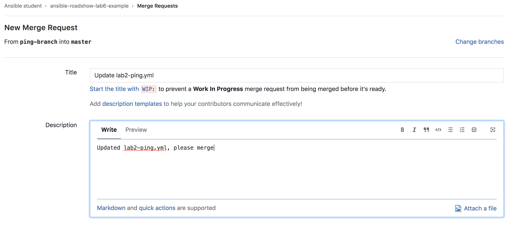

:thumbsup: A merge request (also called pull request) is a place where you can collaborate around ongoing development. It is a good practice to write a brief description of the changes you've done, so that anyone reviewing or collaborating with you doesn't necessarily have to read your code to figure out what was done.

Once you've written the description for your modifications, at the bottom of the page you will see this:

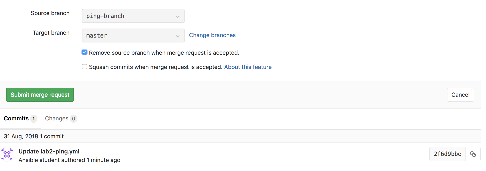

Source branch allows you to choose which branch you would like to merge to the target branch of your choice, which is master in this case.

:boom: Let's tick the box for Gitlab to automatically remove the source branch once the merge (pull) request has been accepted.

:thumbsup: It is considered a best practice to remove any branches which have been merged, as this allows you to keep tabs on ongoing development. If a branch has existed for a long time, this may indicate that someone has bitten off a bit too large chunk to swallow in a reasonable time. If a branch lives for a longer time, that often means it will be more difficult to merge, as there is risk that the development conflicts with other ongoing development. Rather than doing everything in one large merge/pull request, do it in several small ones, if you are doing significant development.

You will now get redirected to the page which overviews your merge (pull) request. Here you can use the comment function displayed in the 'Discussions' tab to collaborate with other people.
Perhaps your change needs a code review or you need some advise on how to solve a specific problem? The 'Commits' and 'Changes' allow you to overview all changes made into your newly created branch.

:boom: Before you press 'Merge', explore the 'Discussions' feature and try to add yet another change to your playbook. Review how all your changes are visible on the merge (pull) request page.

The merge (pull) request has yet another function, which is to allow someone else than you to approve changes, before they get copied into your master branch. Normally, not everyone have rights to accept merge (pull) request, which will copy all your changes into the master branch from this temporary branch where you do your work.

:boom: In this case, accept the absolutely terrific changes that you've made and press the Merge button.

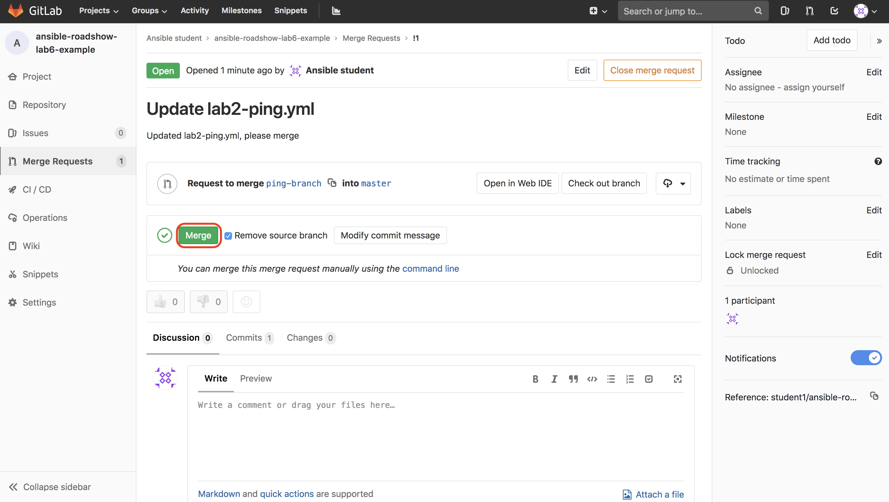

After the merge (pull) request has been accepted on the main page of the project you will see the merge as commit to the main branch of the project:

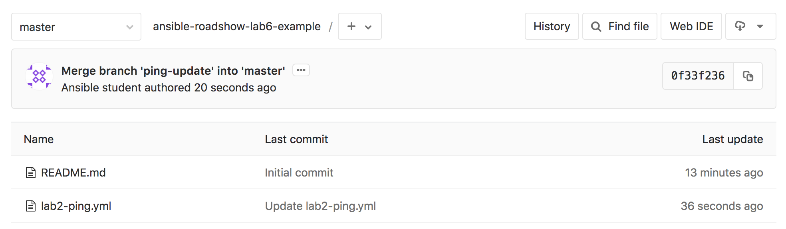

Again: the reason you delete your branch afterwards is because that allows people to see when work has been completed.

:star: If you want to try out the basics of git, go here: https://try.github.io and complete the excersises.

```
End of lab
```

[Go to the next lab, lab 7](../lab-7/README.md)

# Working with your playbooks on GitHub
:exclamation:  :exclamation:
This chapter needs work. Please fix and close associated issues:
https://github.com/mglantz/ansible-roadshow/issues/36
https://github.com/mglantz/ansible-roadshow/issues/41
:exclamation:  :exclamation:

As an example of a git based version handling/collaboration system, we'll use GitHub for simplicity.

>As a first step, go ahead and create a new repository on GitHub and put the ping playbook [that you created in lab-2](https://github.com/mglantz/ansible-roadshow/tree/master/labs/lab-2/README.md) there.

>Next step, go ahead and make a change to your playbook via the GitHub web UI. When you commit the change, select 'Create a new branch for this commit and start a pull request.' as depicted below.

 

What happens next is that your change is copied into this new copy of your repository, called a branch. This is so that you and others can collaborate on this change, without affecting the code in the master branch (copy) of your repository. This allows your master branch to be stable, while development is ongoing. This also allows for several people to work on the code in your repository, at the same time.

>Now click on 'Create pull request' to complete the creation of the new branch and copying your change to it.

 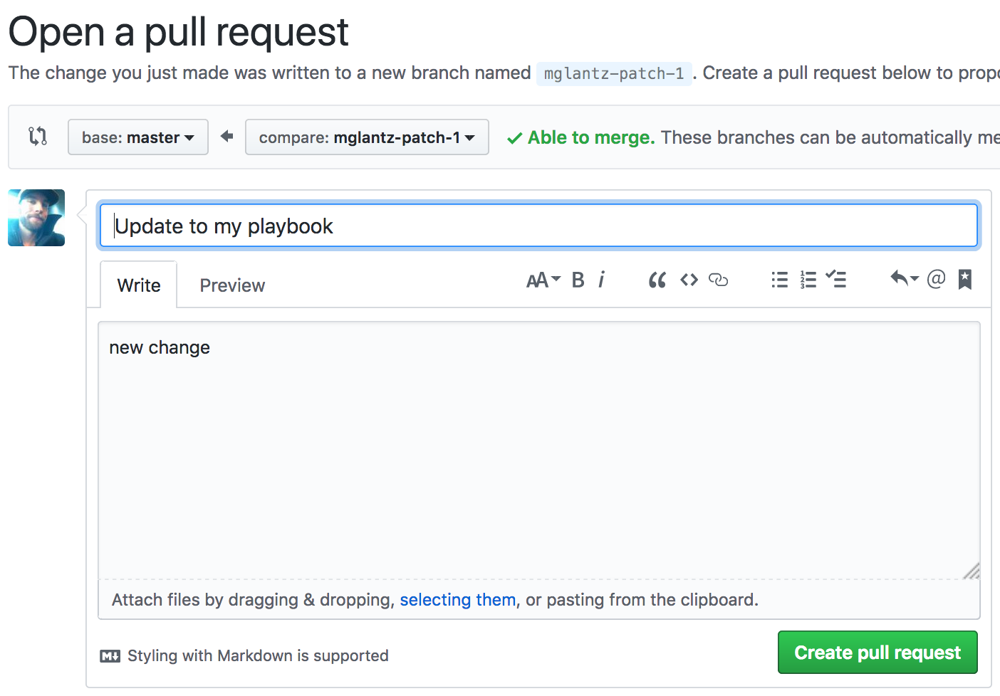

You will now get redirected to the page with overviews your pull request. Here you can use the comment function displayed in the 'Conversation' tab to collaborate with other people. Perhaps your change needs a code review or you need some advise on how to solve a specific problem? The 'Commits' and 'Files changed' allows you to overview all changes made into your newly created branch, from now on.

>Explore the 'Conversation' feature and try add yet another change to your playbook and review how all your changes are visible on the pull request page.

The pull request has yet another function, which is to allow someone else than you to approve changes, before they get copied into your master branch. Normally, not everyone has access to 'Merge pull request' which will copy all your changes into the master branch from this temporary branch where you do your work.

>After having merged your work, select to delete your branch.

 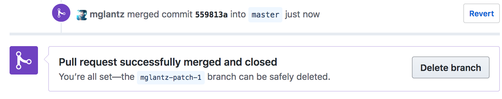

 The reason why you delete your branch afterwards is because that allows people to see when work has been completed. Also, it allows someone to overview the status of the development work being done. For example, if a branch has lived on for too long, the risk of merge conflicts (when several people has changed the same files) becomes greater. Because of that and because code quality usually suffers when you do too much work at once, try biting off a good sized chunk of work. It's better that you do several smaller chunks of work than one huge chunk which takes a long time to do.
 
:star: If you want to try out the basics of git, go here: https://try.github.io and complete the excersises.

```
End of lab
```
[Go to the next lab, lab 7](../lab-7/README.md)
