# Introducing Ansible Tower

Red Hat Ansible Tower (build from the ) helps you scale out your Ansible automation. Running Ansible from a command-line interface is all good, until you start to automate more things. When you do that, you get a number of concerns, primarily:

>How can I control who can run what playbooks where?

This is a central concerns which stimms from the fact that sharing access is difficult. Because of this, some companies don't even allow people to share access, because of (valid) security concerns, security compliance requirements on separation of duty, and more.

Very often, you fail to automate things because it was not possible to share access. As an example, if you want to automate
the configuration of SAN storage at your company, your SAN storage switches may not allow granular enough access so that the users which you use to do the automation - can only do what you need it to do (which in that case would be to zone-in a disk to one or more specific servers).

Because of this, it's not uncommon that attempts to automate things fails with conversations like:

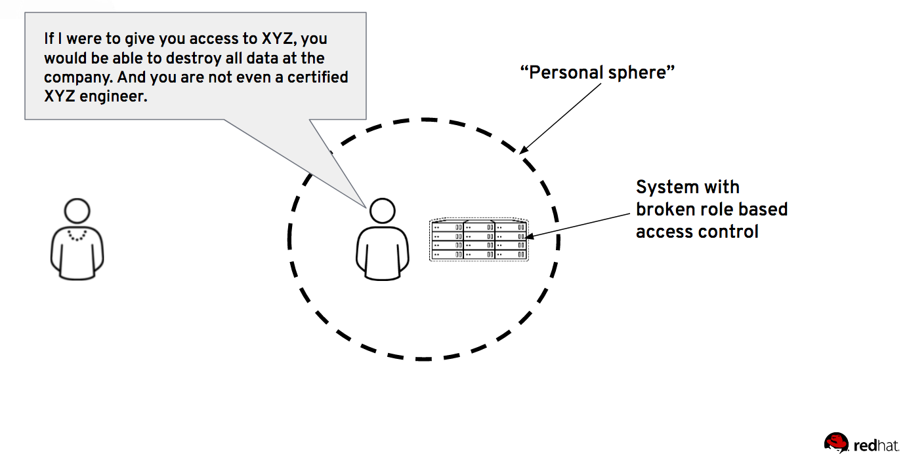

Ansible Tower allows you to share access safely to other people via it's web GUI, CLI client and REST API. Let's explore how this works.

:boom: First step, with your web browser, go to your Ansible Tower server: https://$Tower_Server and login with the _admin_ user and the password provided to you at the start of the lab.

What we'll do first is to create an inventory in Ansible Tower, an inventory is a collection of hosts you can run playbooks against in Tower; just like your *hosts* file in the previous examples. Inventories are assigned to organizations, while permissions to launch playbooks against inventories are controlled at the user, team or playbook level.

Create an inventory called "workshop-inventory" by following the instructions below.

:boom: To create a new inventory, click on the 'Inventories' tab and click the add button.

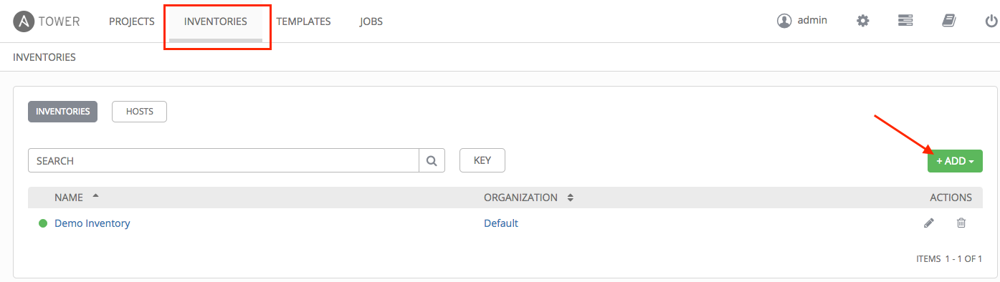

:boom: Insert values as in below screenshot.
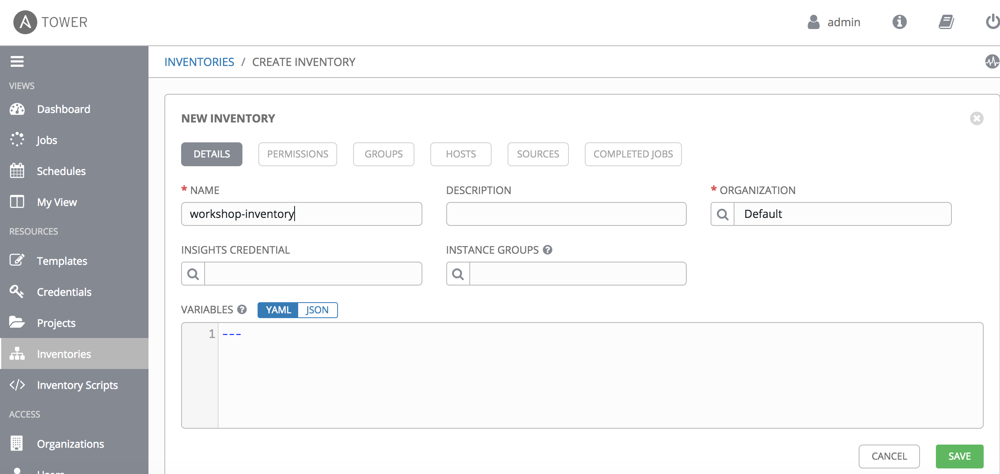

Now we need to add our hosts to the newly created inventory.

:boom: Click "INVENTORIES" -> "workshop-inventory"

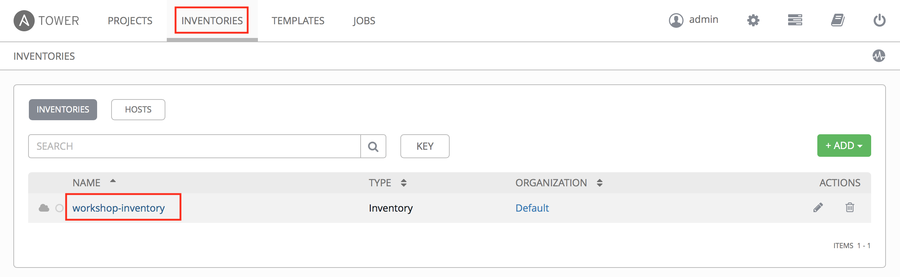

:boom: From the inventory view, we click "Hosts" and then "Add host"
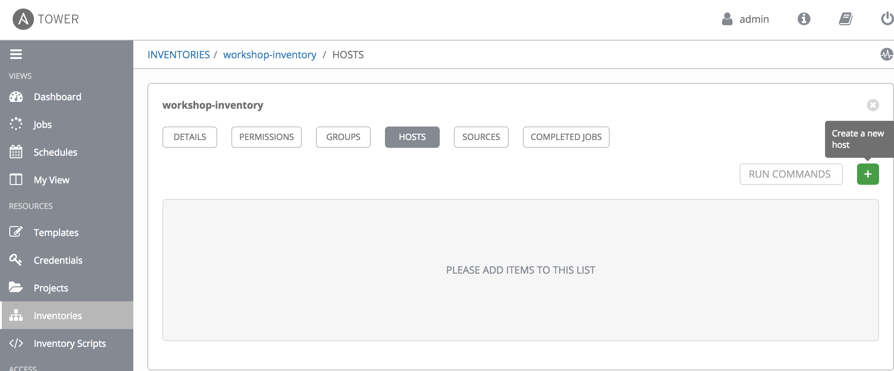

:boom: Fill in values as according to your **$WORK_DIR/hosts** file.
* Host names: _wildfly1, wildfly2 and loadbalancer1_
* Variables: _ansible_host: IP-address-of-system_

:exclamation: Be careful. If you make a mistake here and do not fill things in according to $WORK_DIR/hosts it will get messy.

For instance in the following screenshot example values are provided for *wildfly1*. Refer to the previously created *hosts* file for IP values.
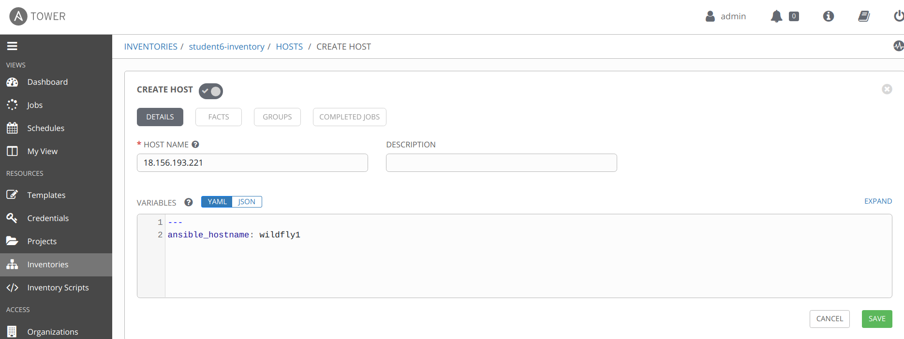

 :thumbsup: Please note that in a normal scenario, the inventory information would get automatically synced into Ansible Tower using a _dynamic inventory script_. There are out-of-the-box inventory scripts for all common cloud providers, including a lot of other infrastructure services and you can create your own custom inventory scripts as well. To use dynamic inventory scripts is the best practice, as it keeps inventories in-sync with the world.

Next thing we'll do is to define a set of credentials to our systems. This is what is typically the tricky bit when you run Ansible playbooks from a command line. If you use a SSH key or username to an admin user to run your playbook, how can someone else run the playbook without you risking that person finding out the credentials - giving that person the ability to just SSH in manually to the system and run whatever he/she likes?

Credentials authenticate the Tower user to launch Ansible playbooks, which can then include passwords and SSH keys, against inventory hosts. You can also require the Tower user to enter a password or key phrase when a playbook launches using the credentials feature of Tower.

:boom: Click on the gears in the top right corner, and select credentials\
:boom: Create a new set of credentials which you call 'machine-credentials' as follows.
* Credentials type: Machine
* Username: student
* Privilege Escalation Method: sudo
* SSH Private Key: the content of: https://raw.githubusercontent.com/mglantz/ansible-roadshow/master/content/id_rsa

 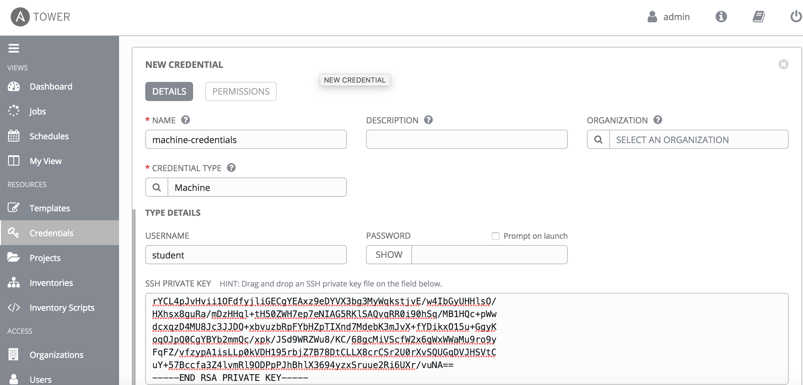

When you have saved your credentials, please note that the SSH Private key now reads "ENCRYPTED". This is because the key is now encrypted within Tower. It is not possible to get back the cleartext key, ergo, it's now safer to share this access with other people. Even the user (root) used, can also be obscured, only learning the name and description of the credentials visible.

Next thing that we'll do is to create a project. A Project is a logical collection of Ansible playbooks, represented in Tower.
You can manage playbooks and playbook directories by either placing them manually under the Project Base Path on your Tower server, or by placing your playbooks into a source code management (SCM) system supported by Tower, including Git, Subversion, and Mercurial.

:boom: Create a project called "workshop-playbooks" by following the instructions below.

:boom: To create a new project, click on the 'Projects' tab and click on the add button. Make sure to link your project to the GitHub repository, which [you created earlier in lab-6](https://github.com/mglantz/ansible-roadshow/tree/master/labs/lab-6). 

:boom: To get the correct URL, go to the GitLab server and click on the indicated button below.
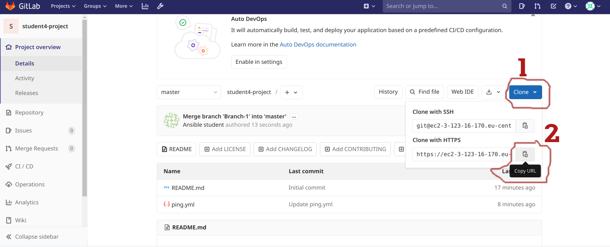

:boom: Then go ahead and put the information into the create project page.
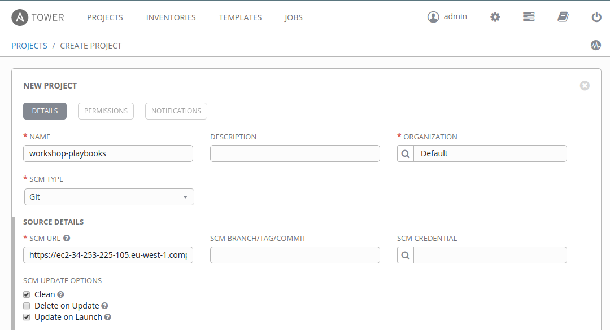

:exclamation: Please note that we've select the _Update on launch_ so that when a playbook launch from this Git repository we ensure that we have the latest version available. Also that we select _Clean_ to ensure we get a fresh download of everything.

:boom: Verify that the project has synced with your Git repository by checking the details shown below.
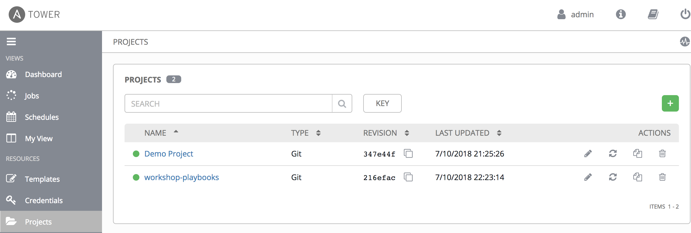

Next you will provide access to the playbook which [you put onto GitHub earlier in lab-6](https://github.com/mglantz/ansible-roadshow/tree/master/labs/lab-6). This is done using so called job templates. A job template combines an Ansible playbook from a project and the settings required to launch it.

:boom: Create a job template called "workshop-template" which links to the playbook which you created earlier, as follows. Click "TEMPLATES" -> "ADD" -> "Job Template"
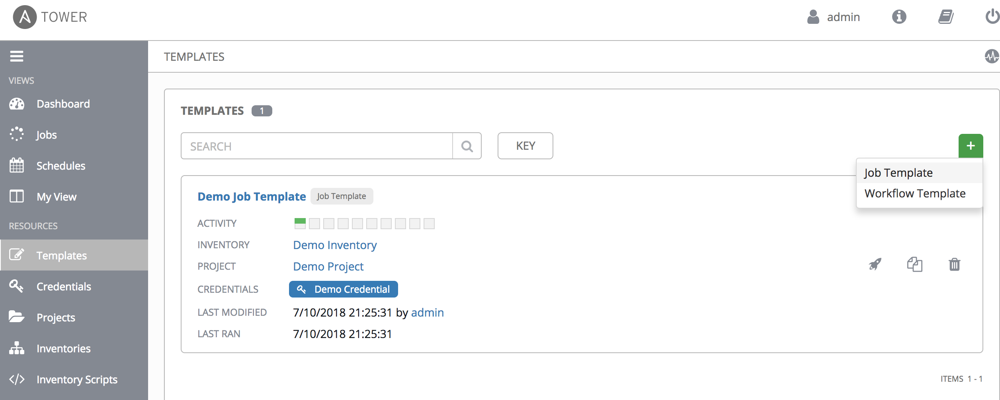

:boom: Fill in values as in this screenshot
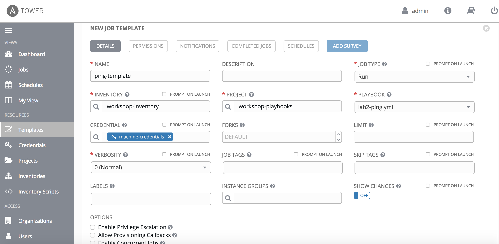
and click 'SAVE'.

:boom: Now try to run your playbook. (press the rocket, next to the name of the template). This should run the ping playbook successfully. 

If you now go to the 'Jobs' tab, you can review your specific run of the playbook, it lists information from the playbook run, who ran it and against what systems the playbook was run. This is all vital information as it allows visibility over what's being done in your infrastructure or application landscape.

:thumbsup: This may seem as a poor first _playbook as a service_, but the concept is rather useful actually. People often wants to know what the status of systems are, or if two different systems can reach each other or not - to troubleshoot etc network related problems. This very simple playbook does allow people with access to it to check connectivity from the Ansible Tower server to the managed systems - without having terminal/shell access to either the Ansible Tower server or to the managed systems. With a little modifications, your "ping" playbook could for example allow people to ping any server from any server. That could be really useful troubleshooting tool. This is a friendly reminder that you can use Ansible to do more things than setting up complex systems ;)

Next we are going to provide this playbook, _as a service_ to a new user, to see how we (safely) can provide any Ansible automation as a self service.

:boom: Create a new user, by going to 'Settings (the cog to the right of the admin user icon)' and then users. Call the user workshop-guest and set a password for it. After saving the user go to it and configure it further:\
:boom: Click on the 'Permissions' tab and give your user access to run this one job template with Execute rights, not Admin. Do not provide access to either the project or the inventory, only the 'job template'.

:boom: Login as the user and run the playbook again. Review what you can see and what you can change as this user. This is how you can provide any piece of Ansible automation as a service, in a secure manner, to specific users.

Next we are going to run this playbook via the Tower CLI. You can do it as your normal user or the guest user you created earlier.

:boom: From your terminal on the Ansible Tower server you use the _tower-cli_ tool to launch the job template you created earlier.

:boom: Explore the tool by using
```
$ tower-cli --help
$ tower-cli job --help
```
:boom: and launch your playbook.

:star: If you have time, also try adding the below flag:
```
--monitor
```

```
End of lab
```
[Go to the next lab, lab 8](../lab-8/README.md)
