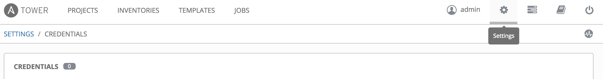
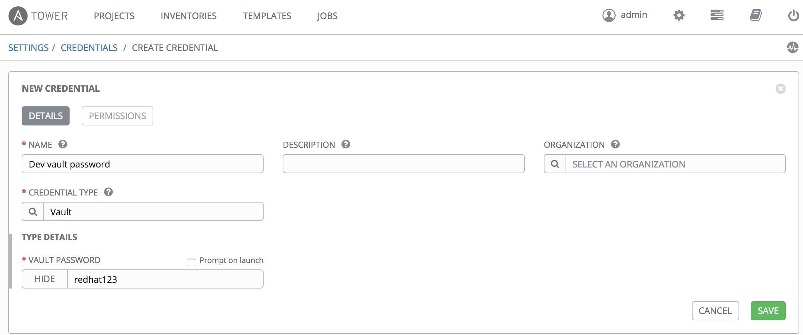

# Installing wildfly and nginx from Tower

As the good developer you are, you want to make your playbooks for provisioning the wildfly app available for the whole organization to run and benefit from. This lab will describe how you can do so.

First you need to instruct Ansible Tower to use the nginx module. You could install the module on Tower as previously, but this would have the unwanted effect that all projects on the Tower server would rely on this module. Furthermore the Tower server now needs special care if you need to reinstall it. Instead we'll instruct Tower to include the nginx module as part of our project. To do so, add a file *$WORK_DIR/roles* called *requirements.yml*, with the following content
```
---
- src: https://github.com/nginxinc/ansible-role-nginx
  version: master
  name: nginxinc.nginx
```
Check in the change and you are ready to go.

Login to the Ansible Tower server on the url and username/password provided by the instructor.

You've made the Inventory and Project for getting started in the previouse lab, but there are some additional stuff you need to do. First you need to create the groups and add hosts to the groups. To do so go to "INVENTORIES" -> "workshop-inventory" -> GROUPS". Here click "+ADD GROUP".


Create three groups named:
* dev
* wildflyservers
* lbservers

Click "SAVE" for each group.

Next add the hosts to the correct groups. For each group click on the group name and then on the "HOSTS" tab. For instance clicking "dev" -> "HOSTS" will bring you to the following screen, where you can add hosts to the group


* Add all hosts to the dev group.
* Add client_system_1 to the lbservers group
* Add client_system_2 and client_system_3 to the wildflyservers group

Using above described method.

Next you need to setup the vault password for your playbooks. To do so click the *settings* menu item in top of the menu


On the items, which appear click *credentials*. Then click *ADD*. Select Vault as credential type and the fill in values as provided in below screenshot (replace password with whatever you chose).

Click *SAVE* and you're done with this part.

Phew that's a lot of work. Luckily there is other ways of doing this, but the GUI is the easiest way to help you understand what's going on. Maybe grap a cup of cofee at this point - almost there.

The template is where it all comes together. So now click the *TEMPLATES* menu item and click *ADD* and select *Job Template*. Fill in values as below

be aware that in order to select the credentials, you must use the search button and select credential type as appopriate.


Now you should be able to launch your playbooks. Click the *TEMPLATES* menu item. Then click the rocket to the right of the 'Install Wildfly App' template.


This should succeed succesfully. Do the same for the other template.

Last step is to create a workflow to pull it all together. To do this, you can create a Workflow Template. So click on the *TEMPLATES* menu item and select *ADD - Workflow Template*. Name the template 'Install full application stack' and click *SAVE*. Now the *WORKFLOW EDITOR* button is active. Click on the button. This will take you to the following screen


if you now click the *START* button, you get to invoke a template. On the right side of the screen, you can select the 'Install Wildfly App' template and click *SELECT*. This will add the template to the workflow. When you move the cursor over the added template, a plus sign appears to the right on the box. Click it and a new template is added. Using the same method choose 'Install load balancer' as the template. This template should only run if the previous succeeded. At this time your workflow should look like this


Now you can run the workflow template as any other template. Nifty right?

You can also run templates in parallel and sync projects with the repos. If you have spare time, try playing with the features.

A note is that the changes made in lab 8 will break the ping template. This is because the addition of groups to the inventory adds some secrets. The correct solution is to create a new inventory for the ping playbook without the groups added. A quicker fix is to add the vault password to the ping template.

```
End of lab
```
[Go to the next lab, lab 9](../lab-9/README.md)
