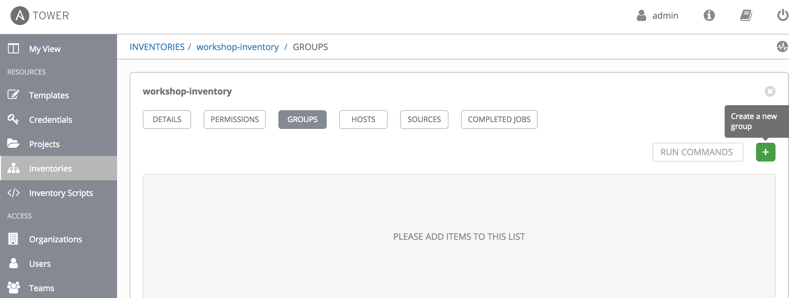
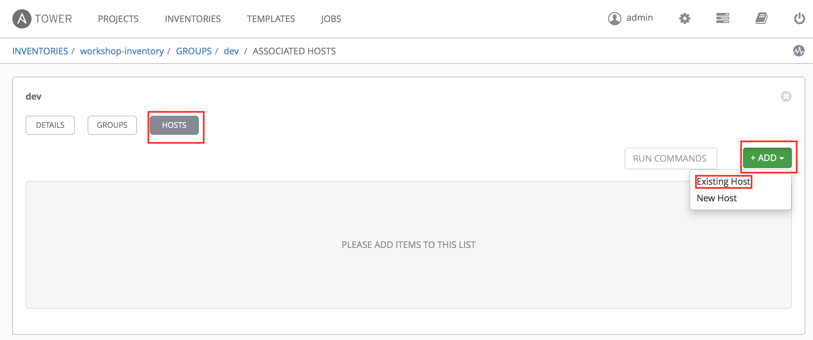
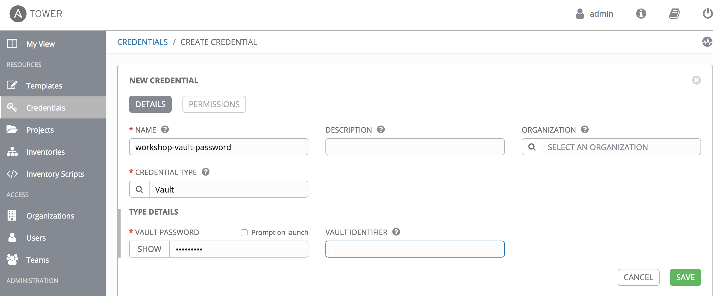
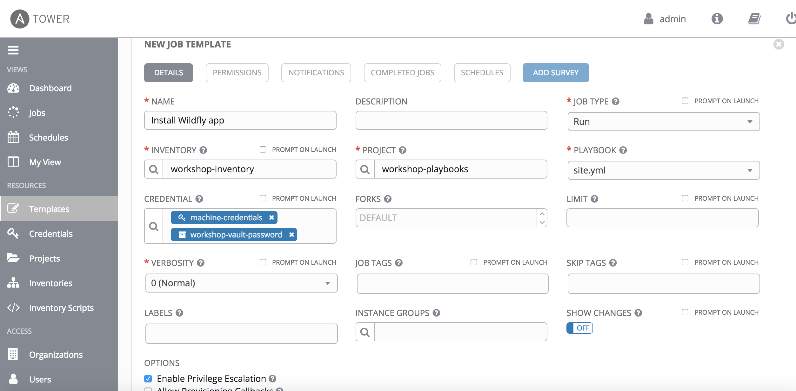
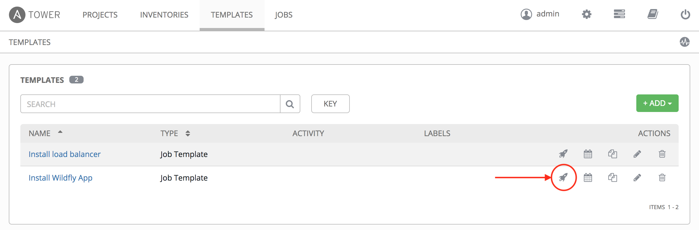
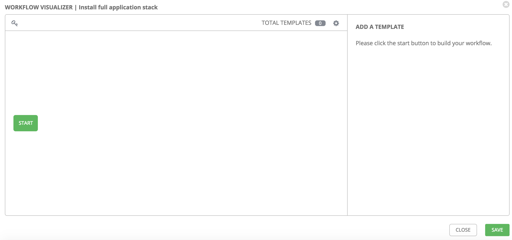
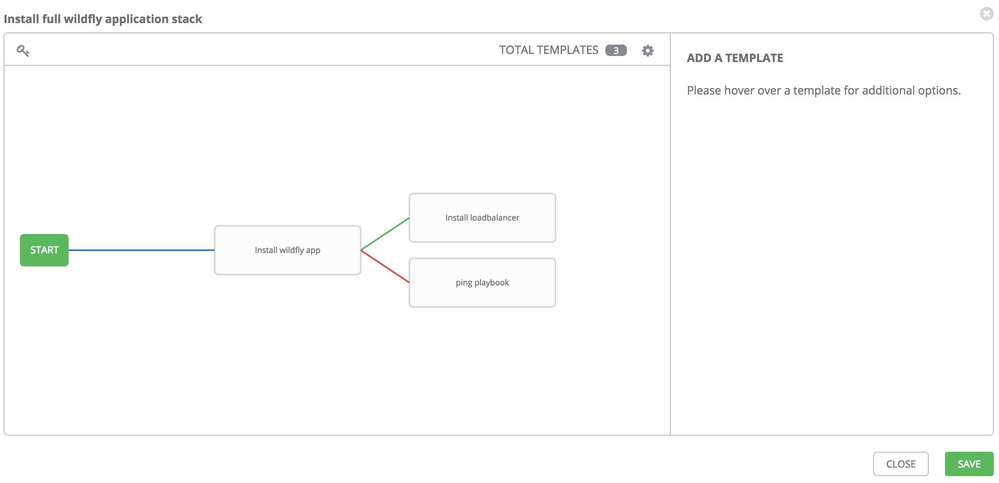

# Installing WildFly and Nginx from Tower

As the good developer you are, you want to make your playbooks for provisioning the WildFly app available for the whole organization to run and benefit from. This lab will describe how you can do so.

The first step is to transfer your work that you did in $WORK_DIR on a local server, to the central git repository. As the whole company is going to run this, you need to version control your work and you would also like to enable people to contribute to your work, to make it better.

First, we need to configure the git client with your information. Replace the X in studentX with your assigned number., then run below commands in a terminal:
```
git config --global user.email "studentX@domain.suffix"
git config --global user.name "studentX"
```
Then we're going to check out the _git repository_ which you created earlier, in **lab 7**, where you again place the X in studentX with your assigned number. Run below commands in a terminal:

```
cd
git clone https://GITLAB-SERVER-DOMAIN-NAME/studentX/studentX-project.git
```

The output should be similair as follows:
```
$ git clone https://ec2-52-57-173-62.eu-central-1.compute.amazonaws.com/student1/student1-project.git
Cloning into 'student1-project'...
remote: Enumerating objects: 7, done.
remote: Counting objects: 100% (7/7), done.
remote: Compressing objects: 100% (5/5), done.
remote: Total 7 (delta 1), reused 0 (delta 0)
Unpacking objects: 100% (7/7), done.
```

This will have created a directory called /home/student/studentX-project where your files in the git repository has been copied. Now we're ready to copy your work in $WORK_DIR into this directory. Do this by running below commands (_replace X in studentX with your assigned number_):
```
cp -R $WORK_DIR /home/student/studentX-project
```

Next we need to tell git that we've added a bunch of new files. Run below commands to do that (_replace X in studentX with your assigned number_):
```
cd ~/studentX-project
git add *
```

Now we can create a commit message for the changes we've made. A commit message is ment to be useful for other people, when scanning a repository for what changes has been made. _Ensure you are in the /home/student/studentX-project directory_ and run:
```
git commit -m 'Moving my local workspace to git'
```

The output should be similair as:
```
$ git commit -m 'Added workshop workspace to git'
[master 726a864] Added workshop workspace to git
 28 files changed, 356 insertions(+)
 create mode 100644 binaries/example-jaxrs-war-swarm.jar
 create mode 100644 group_vars/dev/wildflyservers/vars.yml
 create mode 100644 group_vars/dev/wildflyservers/vault.yml
 create mode 100644 hosts
 create mode 100644 lb.yml
 create mode 100644 main.yml
 create mode 100644 mypassword
 create mode 100644 roles/nginx-config/README.md
 create mode 100644 roles/nginx-config/defaults/main.yml
 create mode 100644 roles/nginx-config/handlers/main.yml
 create mode 100644 roles/nginx-config/meta/main.yml
 create mode 100644 roles/nginx-config/tasks/main.yml
 create mode 100644 roles/nginx-config/templates/default.template
 create mode 100644 roles/nginx-config/tests/inventory
 create mode 100644 roles/nginx-config/tests/test.yml
 create mode 100644 roles/nginx-config/vars/main.yml
 create mode 100644 roles/wildflyapp/README.md
 create mode 100644 roles/wildflyapp/defaults/main.yml
 create mode 100644 roles/wildflyapp/handlers/main.yml
 create mode 100644 roles/wildflyapp/meta/main.yml
 create mode 100644 roles/wildflyapp/tasks/main.yml
 create mode 100644 roles/wildflyapp/templates/wildflyapp.template
 create mode 100644 roles/wildflyapp/tests/inventory
 create mode 100644 roles/wildflyapp/tests/test.yml
 create mode 100644 roles/wildflyapp/vars/main.yml
 create mode 100644 site.retry
 create mode 100644 site.yml
 create mode 160000 student1-project
 $
```

There is now only one last thing to do, that is to upload the files to the central GitLab server. _Ensure you are in the /home/student/studentX-project directory_ and run below command. You will there be queried for the studentX credentials to the GitLab server:
```
git push
git config --global push.default matching
```

Output should be something similair as this:
```
$ git push
warning: push.default is unset; its implicit value is changing in
Git 2.0 from 'matching' to 'simple'. To squelch this message
and maintain the current behavior after the default changes, use:

  git config --global push.default matching

To squelch this message and adopt the new behavior now, use:

  git config --global push.default simple

See 'git help config' and search for 'push.default' for further information.
(the 'simple' mode was introduced in Git 1.7.11. Use the similar mode
'current' instead of 'simple' if you sometimes use older versions of Git)

Username for 'https://ec2-52-57-173-62.eu-central-1.compute.amazonaws.com': student1
Password for 'https://student1@ec2-52-57-173-62.eu-central-1.compute.amazonaws.com': 
Counting objects: 47, done.
Delta compression using up to 2 threads.
Compressing objects: 100% (25/25), done.
Writing objects: 100% (46/46), 54.50 MiB | 94.66 MiB/s, done.
Total 46 (delta 1), reused 0 (delta 0)
To https://ec2-52-57-173-62.eu-central-1.compute.amazonaws.com/student1/student1-project.git
   10ed357..726a864  master -> master
$ 
```

```
WARNING! ATTENTION!
```
 :boom:  :boom: **Now that you have moved all work to _/home/student/studentX-project_ let's change the WORK_DIR variable. Change the X in studentX to your assigned number and run:**  :boom:  :boom:
```
export WORK_DIR=/home/student/studentX-project
```

Now you need to instruct Ansible Tower to use the Nginx module. You could install the module on Ansible Tower as previously, but this would have the unwanted effect that all projects on the Ansible Tower server would rely on this module. Furthermore the Ansible Tower server now needs special care if you need to reinstall it. Instead we'll instruct Ansible Tower to include the Nginx module as part of our project. To do so, add a file *$WORK_DIR/roles* called *requirements.yml*, with the following content
```
---
- src: https://github.com/nginxinc/ansible-role-nginx
  version: master
  name: nginxinc.nginx
```
Check in the change and you are ready to go. Do that by running below in a terminal:
```
cd $WORK_DIR/roles
git add requirements.yml
git commit -m 'Requirements file for roles'
git push
```

The output should be similair as this:
```
$ cd $WORK_DIR/roles
$ git add requirements.yml
$ git commit -m 'Requirements file for roles'
[master 234de4e] Requirements file for roles
 1 file changed, 4 insertions(+)
 create mode 100644 roles/requirements.yml
$ git push
Username for 'https://ec2-52-57-173-62.eu-central-1.compute.amazonaws.com': student1
Password for 'https://student1@ec2-52-57-173-62.eu-central-1.compute.amazonaws.com': 
Counting objects: 6, done.
Delta compression using up to 2 threads.
Compressing objects: 100% (4/4), done.
Writing objects: 100% (4/4), 476 bytes | 0 bytes/s, done.
Total 4 (delta 1), reused 0 (delta 0)
To https://ec2-52-57-173-62.eu-central-1.compute.amazonaws.com/student1/student1-project.git
   a8a991b..234de4e  master -> master
$
```

Now, login to the Ansible Tower server using your web browser on with the url and username/password provided to you by the instructor.

You've made the Inventory and Project for getting started in the previous lab, but there are some additional stuff you need to do. First you need to create the groups and add hosts to the groups. To do so go to "INVENTORIES" -> "workshop-inventory" -> GROUPS". Here click "+ADD GROUP".


Create three groups named:
* dev
* wildflyservers
* lbservers

Click "SAVE" for each group.

Next add the hosts to the correct groups. For each group click on the group name and then on the "HOSTS" tab. For instance clicking "dev" -> "HOSTS" will bring you to the following screen, where you can add hosts to the group



* Add all hosts to the dev group.
* Add loadbalancer1 to the lbservers group
* Add wilfly1 and wildfly2 to the wildflyservers group

Using above described method.

Next you need to setup the vault password for your playbooks. To do so click the *settings* menu item in top of the menu


On the items, which appear click *credentials*. Then click *ADD*. Select Vault as credential type and the fill in values as provided in below screenshot (replace password with whatever you chose).

Click *SAVE* and you're done with this part.

Phew that's a lot of work. Luckily there is other ways of doing this, but the GUI is the easiest way to help you understand what's going on. Maybe grab a cup of coffee at this point - almost there.

The template is where it all comes together. So now click the *TEMPLATES* menu item and click *ADD* and select *Job Template*. Fill in values as below

be aware that in order to select the credentials, you must use the search button and select credential type as appropriate.


Now you should be able to launch your playbooks. Click the *TEMPLATES* menu item. Then click the rocket to the right of the 'Install WildFly App' template.



This should succeed successfully. Do the same for the other template.

Last step is to create a workflow to pull it all together. To do this, you can create a Workflow Template. So click on the *TEMPLATES* menu item and select *ADD - Workflow Template*. Name the template 'Install full application stack' and click *SAVE*. Now the *WORKFLOW EDITOR* button is active. Click on the button. This will take you to the following screen



if you now click the *START* button, you get to invoke a template. On the right side of the screen, you can select the 'Install WildFly App' template and click *SELECT*. This will add the template to the workflow. When you move the cursor over the added template, a plus sign appears to the right on the box. Click it and a new template is added. Using the same method choose 'Install load balancer' as the template. This template should only run if the previous succeeded. At this time your workflow should look like this



Now you can run the workflow template as any other template. Nifty right?

You can also run templates in parallel and sync projects with the repos. If you have spare time, try playing with the features.

The changes made in lab 8 will break the ping template. This is because the addition of groups to the inventory also adds some secrets. If you also want to run the ping template, create a new inventory for the ping playbook without the groups added. Alternatively add the vault password to the ping template as you did with the other templates made.

```
End of lab
```
[Go to the next lab, lab 9](../lab-9/README.md)
